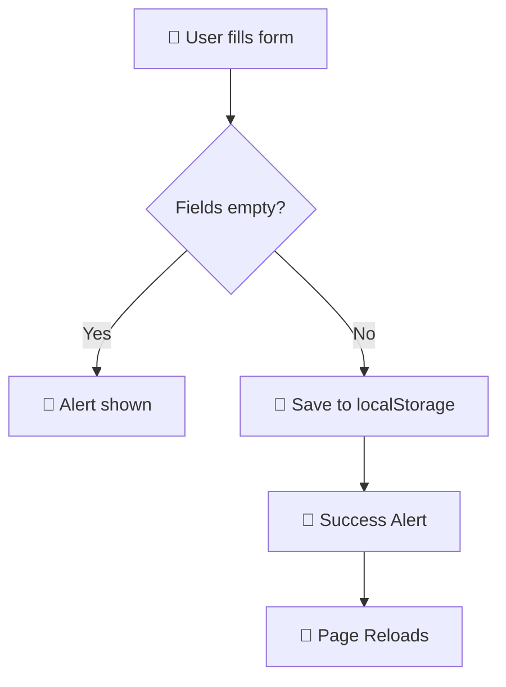

<div align="center">
```
██╗      ██████╗  ██████╗ ██╗███╗   ██╗    ███████╗ ██████╗ ██████╗ ███╗   ███╗
██║     ██╔═══██╗██╔════╝ ██║████╗  ██║    ██╔════╝██╔═══██╗██╔══██╗████╗ ████║
██║     ██║   ██║██║  ███╗██║██╔██╗ ██║    █████╗  ██║   ██║██████╔╝██╔████╔██║
██║     ██║   ██║██║   ██║██║██║╚██╗██║    ██╔══╝  ██║   ██║██╔══██╗██║╚██╔╝██║
███████╗╚██████╔╝╚██████╔╝██║██║ ╚████║    ██║     ╚██████╔╝██║  ██║██║ ╚═╝ ██║
╚══════╝ ╚═════╝  ╚═════╝ ╚═╝╚═╝  ╚═══╝    ╚═╝      ╚═════╝ ╚═╝  ╚═╝╚═╝     ╚═╝
```
🔐 User Registration Form
A sleek, client-side registration experience — no backend required.
<br>


<br>
---
</div>
✨ Overview
> A beautifully crafted **User Registration Form** built with pure HTML, CSS, and JavaScript — no frameworks, no fuss. Data is stored locally in the browser using `localStorage`, making it perfect for demos, prototypes, and learning projects.
<div align="center">
```
┌──────────────────────────────────┐
│        User Registration         │
│  ┌──────────────────────────┐   │
│  │  👤  Enter Username       │   │
│  └──────────────────────────┘   │
│  ┌──────────────────────────┐   │
│  │  🔒  Enter Password       │   │
│  └──────────────────────────┘   │
│  ⚠️  Data stored locally (demo) │
│  ┌──────────────────────────┐   │
│  │        Register          │   │
│  └──────────────────────────┘   │
└──────────────────────────────────┘
```
</div>
---
🚀 Features
Feature	Description
🎨 Gradient Background	Eye-catching blue-to-green gradient
✅ Form Validation	Real-time alerts for empty fields
💾 LocalStorage	Saves user data directly in the browser
🔁 Auto Reload	Page refreshes after successful registration
📱 Responsive	Centered layout that works on all screen sizes
⚡ Zero Dependencies	Pure HTML + CSS + Vanilla JS
---
🛠️ Tech Stack
```
📁 Project
├── 🌐  HTML5        →  Structure & Semantics
├── 🎨  CSS3         →  Gradient, Flexbox, Animations
└── ⚙️  JavaScript   →  Validation + LocalStorage API
```
---
📂 Project Structure
```
📦 Login-Form/
 ┣ 📄 index.html       ← All-in-one: markup, styles & scripts
 ┗ 📄 README.md        ← You're reading it!
```
---
⚙️ How It Works

Step-by-step flow:
User enters a username and password
JavaScript validates both fields are non-empty
User data is saved to `localStorage` as a JSON array
A success alert is displayed with the username
The page automatically reloads for a fresh start
---
💻 Getting Started
Option 1 — View Live 🌐
Click the badge below and you're done!

---
Option 2 — Run Locally 🖥️
```bash
# 1. Clone the repository
git clone https://github.com/balamurugan200526/Login-Form.git

# 2. Navigate to project folder
cd Login-Form

# 3. Open in browser
open index.html        # macOS
start index.html       # Windows
xdg-open index.html    # Linux
```
> 💡 No build steps. No installs. Just open and go!
---
🔍 Code Highlights
🔒 Validation Logic
```javascript
function validateForm() {
    let username = document.getElementById("username").value.trim();
    let password = document.getElementById("password").value.trim();

    if (username === "") { alert("Please enter a username."); return false; }
    if (password === "") { alert("Please enter a password."); return false; }

    // Store to localStorage
    let users = JSON.parse(localStorage.getItem("users")) || [];
    users.push({ username, password });
    localStorage.setItem("users", JSON.stringify(users));

    alert("Registration successful for " + username + "!");
    location.reload();
    return false;
}
```
🎨 Gradient Background
```css
background: linear-gradient(to right, blue, green);
```
---
📸 Preview
```
┌─────────────────────────────────────────────────────┐
│                                                     │
│   🟦🟦🟦🟦🟦🟩🟩🟩🟩🟩  ← Blue → Green Gradient    │
│        ┌───────────────────────────┐               │
│        │     User Registration     │               │
│        │  [    Username Input    ] │               │
│        │  [    Password Input    ] │               │
│        │  ⚠️ Note: Demo only      │               │
│        │  [       Register      ]  │               │
│        └───────────────────────────┘               │
│                                                     │
└─────────────────────────────────────────────────────┘
```
---
🗺️ Roadmap
[x] Basic registration form
[x] LocalStorage integration
[x] Form validation
[ ] 🔐 Password strength indicator
[ ] 👁️ Show/Hide password toggle
[ ] 🌙 Dark mode support
[ ] 📤 Backend integration (Node.js / Firebase)
[ ] 🔑 Login page with credential verification
---
🤝 Contributing
Contributions are welcome! Here's how:
```bash
# 1. Fork the project
# 2. Create your feature branch
git checkout -b feature/AmazingFeature

# 3. Commit your changes
git commit -m "Add some AmazingFeature"

# 4. Push to the branch
git push origin feature/AmazingFeature

# 5. Open a Pull Request
```
---
📜 License
```
MIT License — Free to use, modify, and distribute.
```
---
👨‍💻 Author
<div align="center">
Balamurugan


---
⭐ If you found this project helpful, please give it a star! It means a lot.
```
Made with ❤️ and pure JavaScript — no frameworks harmed in the making of this form.
```
</div>
